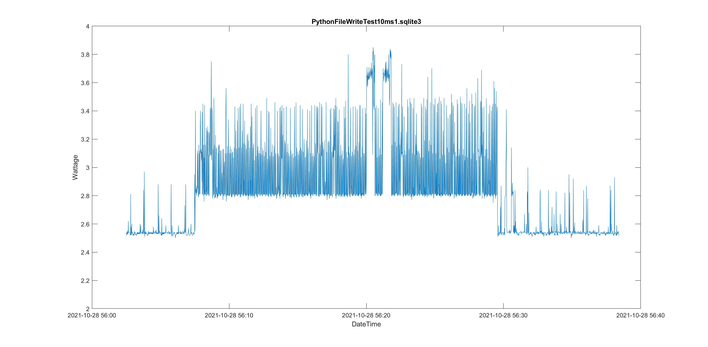

# Miami University ECE 448/9 Senior Design Project Report
## Power Measurement of a Computing System (Fall 2021/Spring 2022)
### By: Owen Hardy ('22), Sam Rutschilling ('22), Jordan Smith ('22)
### Advisors: Dr. Peter Jamieson & Dr. Mark Scott

## Table of Contents
**[Abstract](#abstract)** 
**[Introduction](#introduction)** 
**[Project Background](#project-background)** 
**[Project Research](#project-research)** 
**[Solution Implementation](#solution-implementation)** 
**[Data Findings & Interpretation](#data-findings--interpretation)** 
**[Future Project Goals](#future-project-goals)** 
**[Conclusion](#conclusion)** 

# Abstract
The original goal of this project was to create a power measurement system that could log the power consumption of various perophirals plugged into a power strip.  This would give an idea of how much power each piece of equipment was using at any given time.  After some time had passed in-between semesters, our team and advisors decided to change the scope of the project to develop a hardware solution that could measure the power consumption of various computing tasks.

With this new goal in mind, we developed a list of various computing operations we wanted to measure the power consumption for.  This list included several simple scipts that performed  different functions including sending email messages, writing to files, accessing webpages, and performing basic arithmetic operations. This allows us to understand the power consumption of small computing tasks and their cost.  What our team wanted to understand from our data collection was how much power these different operations consume and determine tasks that required signifigcantly more energy than others.

# Introduction
Our team's focus this first semester of the project was to determine the fesabiity of measuring current draw from a computing system as a whole.  Very early on, a decision was made to conduct our experiments on a Raspberry Pi SBC.  We weren't sure if we would be able to observe current changes when running a script, so we thought it best to initially try on a Rasperry Pi since they have very low power consumption for a system running a full OS.  A typical desktop PC may (1) consume several hundred watts at idle and (2) across several different DC voltage rails.  These two factors could make data collection on this sort of system complex, so we stuck with the Raspberry Pi as a proof of concept.  

# Project Background 

# Project Research

# Solution Implementation
  After we determined that using the Texas Instruments INA219 chip would be an appropriate current and power measurement a method to record the data output by it was needed. The INA 219 utilizes I2C communication so an Arduino Uno was used to communicate between the sensor and a PC used for data collection. On the PC, we created a python script using the Pyserial library to store the data streaming in from the sensor. 

  We decided to use SQLITE to store the data instead of other formats such as .txt (tag delimted text) or .csv (comma seperated value) for several reasons: SQLITE stores data in columns and tables so it is much less likely to become corrupt if it is incorrectly closed or not closed at all. SQLITE also allows easy storage of the date / time value as well, which allows us to store the exact time of a data point. SQLITE also allows easy searching and calculation of averages of data sets as it allows use of all common SQL (structured query language) querys and commands. This allows calculation of the average idle and operation values using just a single query line in the open source DB Browser for SQLITE. These same queries were also used to calculate the time values for each of these scripts. That data was then used to calculate the Power consumption for each computing event event. 
 
 

  

**Figure 1:** Diagram of the complete computing system. The measured system is the Raspberry Pi 3B+ at the center of the layout. The arduino is used for data collection, and the router is used for communicating with the raspberry pi as well as planning for future use.

 
 
  Most of the data collected was collected with a timing of 10ms, which means for every second there are 100 data points, which means that there are several thousand data points for most of the trials. This frequency of data collection is high enough to create enough data so that we can be confident our results are a true representation of the systems power consumption.
   
   
  In the recorded data for each of the trials some jumps and increases can be seen in the data, especially when viewed visually as below. These are background tasks operating on the OS level and should not cause an issue as they are present in both the average baseline power consumption and the average operation power consumption.
   
   

  

  

**Figure 2:** Shows a visual plot of the data from one of the trials, specifically a file write test using Python.

<!--(not the what, more the data)-->
# Data Findings & Interpretation
<!--Add charts with data from averages for each of the below -->
* Python Addition/Subtraction/Multiply/Divide print
* Python Addition/Subtraction/Multiply/Divide no print
* Python Write to file
* Objective-C Write to file
* Python LAN ping print
* Python LAN ping no print
  
  <!-- Equations for power analysis: Time for each operation = time/trials; Average Power an Operation (Watts)= Trials*Average Wattage; Average Power / Operation in kwh= Average in W/s *0.000000277778; Cost = kwh*cost (Nov 2021 Residential Duke energy cost in Oxford ($0.031482)) -->

| Operation | Average Increase in Power (w) | Power Usage / Computing Event (W/s)| Power Usage / Computing Event (kwh) |
| ----------- | ----------- | ------ | --- |
| Python LAN Ping & Print | 0.25 | 0.00286 | 7.94445E-10 |
| Python LAN Ping No Print | 0.19 | 0.001967564 | 5.46546E-10|
| Python Addition & Print | 0.904 | 3.47814E-05 | 9.66151E-12 |
| Python Subtraction & Print | 0.896  | 2.00675E-06 | 5.57432E-13 |
| Python Multiplication by Constant 2 & Print | 0.145 | 0.000472495 | 1.31249E-10 |
| Python Division & Print | 0.189 | 0.000765223 | 1.42579E-10 |
| Python Addition No Print | 0.447 | 1.15415E-06 | 3.20599E-13 |
| Python Subtraction No Print | 0.643 | 1.05705E-06 | 2.93624E-13 |
| Python Multiplication by Constant 2 No Print | 0.195 | 0.00048287 | 1.34131E-10 |
| Python Division No Print | 0.124 | 0.000278534 | 9.02944E-11 |
| Python Write To File | 0.42 | 0.1.1844E-06 | 3.29E-13 |
| Objective-C Write to File | 0.414 | 7.27639E-08 | 2.02122E-14 |

# Future Project Goals
So far, the majority of what we have done is setting up the problem and basic testing to ensure our setup works as we'd expect. In the future, we plan to move onto the next step for the project, that is, the meat of the project. We will be setting up an email server and a script to send emails. Using these, we will be testing the different kinds of content that can be sent via email and how they affect power consumption.

After gathering data from the email servers, we will be looking into the Google Search Bar. Or, more specifically, the auto fill feature of the search bar. The auto fill feature of the Google Search Bar is a process that gives the user options to fill in what they've already typed. For instance, if the user typed "How to" into the search bar, Google might suggest that the query they're searching for is to "how to commit murder", or "how to hide a body", or "how to remove the evidence". Our goal in this instance is to determine how much power having that auto fill feature on at all times will take up over not having it on at all.

# Conclusion

<!-- # Our notes (to be ommitted or relocated)
Be sure to discuss:
* ABET: What decisions and why, ethical impact

Software Utilities used:

https://sqlitebrowser.org/

https://www.anaconda.com/products/individual#Downloads

https://raspberrytips.com/mail-server-raspberry-pi/ (local mail server)

Annaconda Notes:
- Anaconda does not activate correctly on windows unless you open vscode through Anaconda Command Prompt
- Use the command `code .` to start VSCode from Anaconda
- Browse through the folders from there in order to find the github local file location
- This should stop from getting errors related to "dll not found" when importing packages that are actually installed through Anaconda.

https://code.visualstudio.com/docs/remote/ssh

https://code.visualstudio.com/

Notes for VSCode and Arduino:
- Must open arduino .ino file from folders in arduino otherwise it will not find the .json configuration file and will not work correctly

https://www.raspberrypi.org/software/operating-systems/

https://learn.adafruit.com/adafruit-ina219-current-sensor-breakout/arduino-code

https://www.diagrams.net/

Python dataloging program must have sqlite3 and pyserial packages installed.
On windows these can be installed using the Anaconda package manager and the following two commands.
(Anaconda must be installed first: anaconda.org)

Run the following commands in the anaconda command window:

   SQLITE3:
     
     conda install -c blaze sqlite3

   PYSERIAL:
    
    conda install -c anaconda pyserial

Begining tests were completed using:

- Raspberry Pi 3B+
- Ubiquiti Edgerouter EX
- generic USB power measurement meter
- FLUKE 87V Multimeter

Datalogging tests also included:

- INA219 current measurement
- Arduino UNO serial communication with computer

Testbench setup:
- Ubiquiti Edgerouter setup to isolate network traffic for the tests
- router setup with IP address of 10.10.10.1 to reduce the risk it is on the same subnet as test computers (further mitigated by virtual machines)
- router has login setup as miami/redhawk
- raspberry pi login is standard load of raspbery pi OS (pi/raspberry) and IP address is 10.10.10.3
- Program accessed via visual studio code remote SSH from windows virtual machine isolated from network.
- Desktop access is also availible to the raspberry pi through VNC viewer

Test method for determining the required resolution:
1. Connected the meter in between the Raspberry pi and 5V power supply
2. Wait for the Raspberry Pi to boot and current draw to stabilize
3. Connect to the raspberry pi from visual studio code remote-SSH
4. Record the current increase and the time the script took to complete

Average time was approx 5 seconds, current increased from 0.48 amps to 0.71 amps

Test method for datalogging:
1. Connect the current measurement Ardunio (with attatched current measurement IC) to laptop with python datalogging program
2. Connect the incoming 5V power to the raspberry pi to the current/voltage measurement chip
3. Wait for the raspberry Pi to boot and current draw to stabilize
4. Start datalogging using datalogging python script.
5. After a few seconds, start the ping script, and then wait for it to end
6. press ctrl+c on test computer to end execution of the datalogging script

2021-10-04

Changed the Test measurement setup and re ran test scripts.
This time the arduino and raspberry pi were connected to the same ground, so the voltage measurements worked correctly.

After measuring the power usage for running the ping script we ran scripts to determine the power usage various parts of this script may have consumed.
One of these was printing a counting number out to the termineal display, this script took approx 0.02 seconds to run, with an insteneous power draw.

From ping script: It takes 0.018s for each ping.

We then changed this to include a wait statement so that it would take approximitley the same amount of time to run as the other scripts.

This was also applied to the script that counts to 500 without printing to the terminal as this script completes in 0.001071s

Obviously this approach may have issues, considering now there is a "sleep()" timer command also consuming power.
>>>>>>> parent of a49f60a (Update README.md) 

2021-11-15

Values implemented into table. Data analysis was done using the number of trials we completed, and high accuracy estimated values for time from the SQL statements. The method used to measure this was. Copy data from SQL statement file to notepad++ search and replace all data with the exception of the seconds part of the time out. Copy and paste into matlab, calculate the average time. Future goal would be to implement a python search and replace script to do this automatically, similar to what I (sam) have used in previous work projects.

Excel Spreadsheet PowerCalculations was used to calculate the power and time values. Inputs are WattageIdle, Wattage Operation, Average Time (calculated above) and Number of Operations. This greatly simplifies the work from doing it all by hand.

Multipication and Division Operations ran to / from a maximum value of: 1000000000000000000000000000000000000000000000000000000000000000000000000000000000000000000000000000000000000 (1E108), but due to the multiplication and division operations, this only results in a total of 359 operations taking place in either direction.

-->

